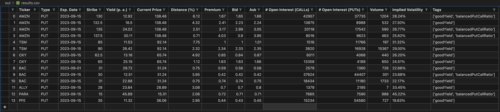

# Options Advisor

[](https://sonarcloud.io/summary/new_code?id=d-lopes_options-advisor) [](https://sonarcloud.io/summary/overall?id=d-lopes_options-advisor) [](<https://snyk.io/test/github/d-lopes/options-advisor>) [](https://mozilla.org/MPL/2.0)

Lightweight Robo-Advisor for Stock Options

The following use case is currently supported: **scan all available options for one or more stocks in a time frame**

Information about stock options for the [underlyings](<https://www.investopedia.com/terms/u/underlying.asp>) are loaded in bulk based on your watchlist ([example](./resources/samples/settings.example.json)), filtered based on the given criteria and either printed on screen or stored on your file system.

Highlighted criteria which you can filter on:

- desired balance between [open interest](https://www.investopedia.com/terms/o/openinterest.asp) for [PUT options](<https://www.investopedia.com/terms/p/putoption.asp>) and for [CALL options](<https://www.investopedia.com/terms/c/calloption.asp>)
- desired market activity based on minimum daily [volume](https://www.investopedia.com/terms/v/volume.asp)
- desired time frame for [expiration dates](<https://www.investopedia.com/terms/e/expirationdate.asp>)
- desired cash 'at risk' based on maximum [strike price](<https://www.investopedia.com/terms/s/strikeprice.asp>)
- desired ROI based on minimum [yield](<https://www.investopedia.com/terms/y/yield.asp>)
- desired intrinsic value based on [moneyness](<https://www.investopedia.com/terms/m/moneyness.asp>)

As result, you can generate a CSV or XLSX file with similar content to this:



The raw information about stock options and market prices is loaded from [Yahoo Finance](https://finance.yahoo.com/) and extended with additional calculations or hints.

## Getting Started

### prerequisites

- python 3.11 must be installed
- the dependencies from the `./requirements.txt` must be installed via pip
    => run this command from command line within the root directory of this repo: `pip3 install -r requirements.txt`
- if you want to export the results of your scan of stock options to XLSX format, then you need to to run `pip install openpyxl` so that you have the required python modules on your local machine

## Usage

### Command line

To run this command from command line, you have the following options:

```console
usage: run.py [-h] -i INPUT_FILE [-mode MODE] [-ms MAX_STRIKE] [-mp MIN_PUTS] [-mc MIN_CALLS]
              [-mv MIN_VOLUME] [-my MIN_YIELD] [-mn MONEYNESS] [-swo START_WEEK_OFFSET]
              [-ewo END_WEEK_OFFSET] [-o OUTPUT_PATH] [-f OUTPUT_FORMAT]

gathers data about stock options

options:
  -h, --help            show this help message and exit
  -i INPUT_FILE         an input file defining the settings to scan for options
  -ds DATASOURCE        yahoofin (default) or yoptions
  -mode MODE            PUT (default) or CALL
  -ms MAX_STRIKE        filter for maximum acceptable strike (Default = 60)
  -mp MIN_PUTS          filter for minium available interest in PUTs (Default = 1000)
  -mc MIN_CALLS         filter for minium available interest in CALLs (Default = 1000)
  -mv MIN_VOLUME        filter for minium available volume (Default = 100)
  -my MIN_YIELD         filter for minimum acceptable yield (Default = 10)
  -mn MONEYNESS         filter for the moneyness: OTM (default), ITM or ATM
  -swo START_WEEK_OFFSET
                        offset from current week to start searching for expiry dates (Default = 3)
  -ewo END_WEEK_OFFSET  offset from current week to end searching for expiry dates (Default = 7)
  -o OUTPUT_PATH        destination to write the result to. If empty, then no data is written to disk. Instead it is printed on screen (Default = None)
  -f OUTPUT_FORMAT      CSV (default) or XLSX (requires python module openpyxl)
```

For example, you can execute the program in your console as follows:

```bash
python3 -m src.run -i ./resources/samples/settings.example.json -ms 35 -o ./out/results.csv
```

After execution, the program will end with a summary similar to this:

```console
searching for PUT options between calendar weeks 52/2023 - 4/2024
|████████████████████████████████████████| 8/8 [100%] in 9.8s (0.77/s)

-------- SUMMARY ---------
finished run on: 04/12/2023, 19:45:41
started scan at: 9 seconds ago (took 9.80 seconds overall)
scanned 2 underlyings: ['AMZN', 'BAC']
applied filter: Filter(min_puts=1000, min_calls=1000, min_volume=100, min_yield=10, max_strike=35.0, moneyness=OTM)
found options: 4
results written to disk: ./out/results.csv
```

### Web interface

will be provided in the future

### Docker

will be provided in the future

## How to test?

simply run `coverage run -m pytest` from the root directory

see answer to following stack overflow article for further info: <https://stackoverflow.com/questions/1896918/running-unittest-with-typical-test-directory-structure>
